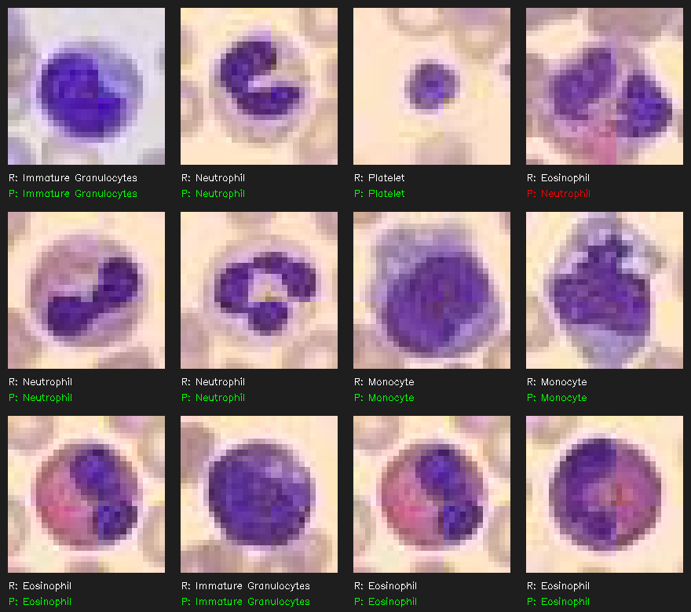

# Convolutional Neural Network (CNN) in C++

This project provides a from-scratch implementation of a Convolutional Neural Network (CNN) written entirely in C++. It is designed to process images through multiple convolutional, pooling, and activation layers, concluding with a Multi-Layer Perceptron (MLP) for final classification. 

The implementation focuses on understanding the underlying mathematics and mechanics of neural networks, including both the forward pass (inference) and backward pass (backpropagation) across all layers without relying on high-level deep learning frameworks.

## Features

- **Custom Tensor Operations:** Implements `Tensor3D` and `Matrix` classes for multi-dimensional data handling and mathematical operations.
- **Convolutional Layers:** Supports custom kernel sizes, stride, and padding configurations.
- **Activation Functions:** Implements ReLU activation.
- **Pooling Layers:** Supports Max Pooling, Min Pooling, and Average Pooling.
- **Multi-Layer Perceptron:** Fully connected dense layers with SoftMax output, incorporating momentum and weight decay.
- **Dynamic Architecture:** Easily stack and build layers dynamically.
- **Visualization:** Integrates OpenCV to load datasets and display the network's predictions on a visual grid.

## Example Results

Below is a 3x4 grid showcasing the results of the model evaluated on random test images from the BloodMNIST dataset. 
The green text indicates correct predictions, while the red text highlights incorrect ones.



## Getting Started

### Prerequisites

- A modern C++ compiler (C++14 or later recommended)
- **OpenCV** (for image loading and result visualization)
- Make (optional, if building via Makefile)

### Building the Project

Compile the project using the provided `Makefile` or your preferred build system:

```bash
make
```

### Running

To train the network and see the evaluation results:

```bash
./cnn
```

## License

This project is licensed under the MIT License. See the [LICENSE](LICENSE) file for details.
